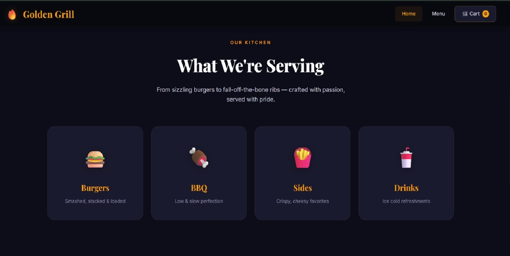
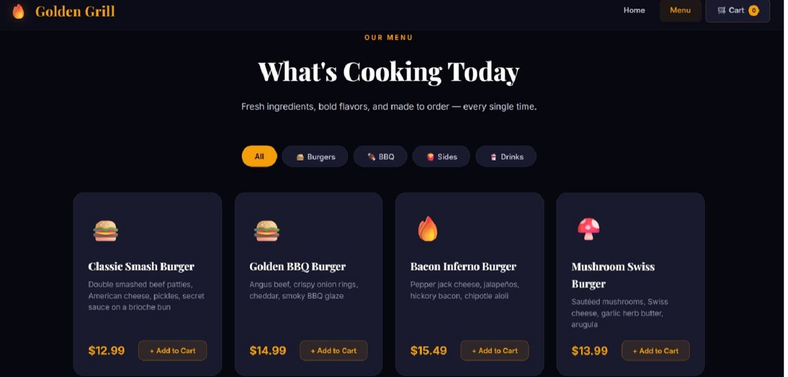
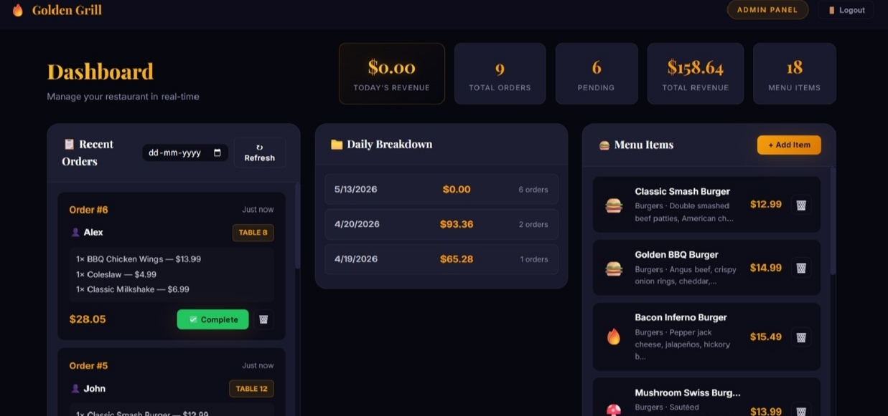

# 🔥 Golden Grill — Restaurant Ordering System

A robust, full-stack restaurant management and ordering system for **Golden Grill**. This system features a luxury customer-facing website, a comprehensive admin dashboard with revenue tracking, and a Node.js/Express backend.

## 📋 Features

### 🛒 Customer Website
- **Dynamic Menu**: Real-time menu loading from the API.
- **Category Filtering**: Browse through Burgers, BBQ, Sides, and Drinks.
- **Smart Cart**: Persistent shopping cart using `localStorage` with quantity controls.
- **Table-Side Ordering**: Place orders directly by providing a name and table number.
- **Aesthetic Design**: Luxury dark theme with glassmorphism and smooth animations.

### 📊 Admin Dashboard
- **Secure Access**: Protected login system (Default: `admin` / `admin123`).
- **Revenue Tracking**: View "Today's Revenue" alongside total historical revenue.
- **Daily Breakdown**: Automatic grouping of orders by date showing revenue and order counts.
- **Order Management**: Real-time order queue with "Mark as Completed" and "Delete/Dismiss" actions.
- **Date Filtering**: Search and filter past orders by a specific date.
- **Menu CRUD**: Full control to Add, View, and Delete menu items.

---

## 📁 Project Structure

```
golden-grill-system/
├── frontend/               # Customer-facing SPA
│   ├── index.html          # Homepage & Hero
│   ├── menu.html           # Menu browsing
│   ├── cart.html           # Checkout & Table info
│   ├── script.js           # Core frontend logic & State
│   └── style.css           # Global luxury design system
│
├── admin/                   # Internal management tools
│   ├── login.html           # Admin authentication
│   ├── dashboard.html       # Management interface
│   ├── admin.js             # Analytics & CRUD logic
│   └── admin.css            # Dashboard-specific styles
│
├── backend/                 # API & Data Layer
│   ├── server.js            # Express server & Routes
│   ├── menu.json            # Menu database
│   ├── orders.json          # Order database
│   └── package.json         # Node.js dependencies
```

---

## 🔗 System Architecture
- **Backend (Node.js + Express)**: Acts as the single source of truth. It serves the static files for both the frontend and admin apps while hosting the REST API.
- **Frontend/Admin**: Both applications communicate with the backend via the `fetch` API. They share the same data sources (`menu.json`, `orders.json`) for seamless real-time updates.
- **Persistence**: Order status and menu items are persisted on the server, while the customer's cart is persisted locally for uninterrupted browsing.

---

## 🛠️ API Documentation

| Method | Endpoint | Description |
| :--- | :--- | :--- |
| **AUTH** | | |
| `POST` | `/login` | Authenticate admin user |
| **MENU** | | |
| `GET` | `/menu` | Retrieve all menu items |
| `POST` | `/menu` | Create a new menu item |
| `PUT` | `/menu/:id` | Update an existing menu item |
| `DELETE` | `/menu/:id` | Remove an item from the menu |
| **ORDERS** | | |
| `GET` | `/orders` | Retrieve all order history |
| `POST` | `/order` | Place a new customer order |
| `PUT` | `/orders/:id` | Update order status (pending/completed) |
| `DELETE` | `/orders/:id` | Permanently delete an order |

---

## 🚀 How to Run

### 1. Prerequisites
- [Node.js](https://nodejs.org/) (v14 or higher installed)

### 2. Installation
Navigate to the backend directory and install dependencies:
```bash
cd backend
npm install
```

### 3. Start the Server
```bash
npm start
```

### 4. Access the Apps
- **Customer Site**: [https://golden-grill-system.netlify.app/]
- **Admin Dashboard**: [https://golden-grill-system.netlify.app/admin/login.html]
  - *Login*: `admin`
  - *Password*: `admin123`

## 📸 Screenshots

### Homepage


### Menu Section


### Mobile View
.jpeg)

### Admin View


## 👨‍💻 Author
**Gaurav Dutta**
